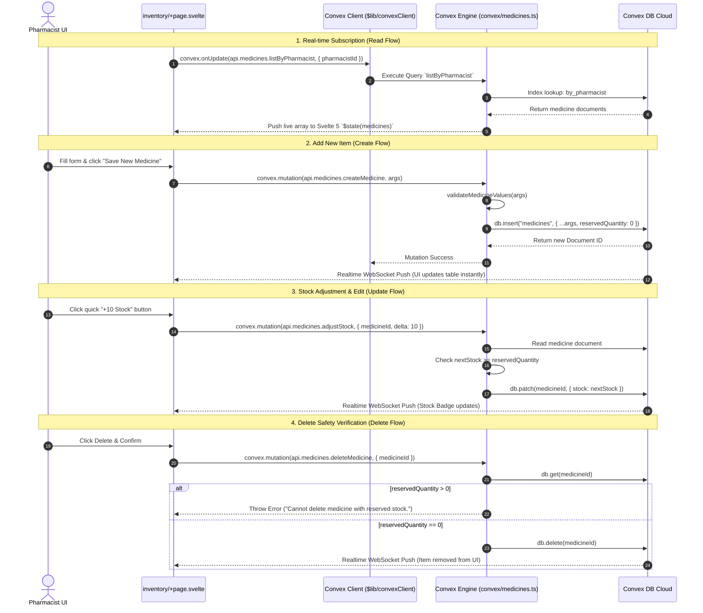

# MediVault Inventory CRUD Architecture & Workflow Documentation

## Overview

The **MediVault Inventory CRUD System** manages medicine stock, pricing, drug interaction conflict rules, prescription flags (OTC vs. Rx), and real-time store-level inventory synchronization. It provides pharmacy owners and pharmacists with full control over their medicine catalog while enforcing strict data validation and atomic reservation safety locks.

---

## 1. System Capabilities & Features

| Action | Function Name | Description | Safety & Validation Rules |
| :--- | :--- | :--- | :--- |
| **Create** | `createMedicine` / `create` | Adds a new medicine item to the store's inventory. | Enforces non-empty brand & generic names; stock and prices must be non-negative numbers; initializes `reservedQuantity: 0`. |
| **Read** | `listByPharmacist` / `list` | Retrieves medicines filtered by store ID, search query, or stock status. | Indexed lookup via `by_pharmacist` index; real-time reactive WebSocket subscriptions using Svelte 5 `$effect`. |
| **Update** | `updateMedicine` / `update` | Modifies catalog data, pricing, symptoms, expiry dates, or Rx flags. | Validates that updated `stock` cannot drop below locked `reservedQuantity` (pending orders). |
| **Stock Adjust**| `adjustStock` | Quick +/- button delta stock adjustments (+10 units, -5 units). | Atomically increments/decrements `stock` while verifying `stock >= reservedQuantity`. |
| **Delete** | `deleteMedicine` / `remove` | Permanently removes a medicine document from the database. | **Safety Lock**: Blocks deletion if `reservedQuantity > 0` to prevent breaking active customer pickup reservations. |

---

## 2. Database Schema (`convex/schema.ts`)

Medicines are stored in the `medicines` database table with the following schema:

```typescript
medicines: defineTable({
  name: v.string(),                  // Brand Name (e.g., "Paracetamol Extra 650mg")
  genericName: v.string(),           // Active Generic Ingredient (e.g., "Paracetamol")
  description: v.string(),           // Clinical dosage instructions & usage description
  imageUrl: v.optional(v.string()),   // Product image URL
  symptoms: v.array(v.string()),     // Indicated symptoms list (e.g. ["fever", "headache", "pain"])
  requiresPrescription: v.boolean(), // true = Rx Required, false = OTC (Over-The-Counter)
  stock: v.number(),                 // Total physical inventory on hand
  reservedQuantity: v.number(),      // Locked units in active customer reservations
  unitCostingPrice: v.number(),      // Unit purchase cost price ($)
  unitSellingPrice: v.number(),      // Unit selling retail price ($)
  expiryDate: v.number(),            // Unix timestamp (ms) for batch expiration
  conflicts: v.array(v.string()),    // Generic drug names with negative interactions
  pharmacistId: v.optional(v.id("users")), // Unique store pharmacist owner binding
})
  .index("by_genericName", ["genericName"])
  .index("by_pharmacist", ["pharmacistId"])
```

---

## 3. End-to-End Data Flow & Sequence Diagram



---

## 4. Detailed Step-by-Step Code Breakdown

### A. Real-time Reactive Subscription (`src/routes/(pharmacist)/pharmacist/inventory/+page.svelte`)

Using Svelte 5 Runes (`$state` and `$effect`), the frontend subscribes directly to live database updates:

```svelte
<script lang="ts">
  let medicines = $state<any[]>([]);

  $effect(() => {
    const userId = data?.user?._id;
    if (!userId) return;

    // Listens for real-time changes in Convex database
    const unsub = convex.onUpdate(
      api.medicines.listByPharmacist,
      { pharmacistId: userId as any },
      (liveMeds) => {
        if (liveMeds) medicines = liveMeds;
      }
    );
    return () => unsub();
  });
</script>
```

---

### B. Create Mutation (`convex/medicines.ts`)

Adds a new medicine record and normalizes user input string arrays:

```typescript
export const createMedicine = mutation({
  args: {
    pharmacistId: v.id("users"),
    name: v.string(),
    genericName: v.string(),
    description: v.string(),
    imageUrl: v.optional(v.string()),
    symptoms: v.array(v.string()),
    requiresPrescription: v.boolean(),
    stock: v.number(),
    unitCostingPrice: v.number(),
    unitSellingPrice: v.number(),
    expiryDate: v.number(),
    conflicts: v.array(v.string()),
  },
  handler: async (ctx, args) => {
    return await ctx.db.insert("medicines", {
      pharmacistId: args.pharmacistId,
      name: args.name.trim(),
      genericName: args.genericName.trim(),
      description: args.description.trim(),
      imageUrl: args.imageUrl || "https://images.unsplash.com/photo-1584308666744-24d5c474f2ae?w=500",
      symptoms: args.symptoms,
      requiresPrescription: args.requiresPrescription,
      stock: Math.max(0, args.stock),
      reservedQuantity: 0,
      unitCostingPrice: args.unitCostingPrice,
      unitSellingPrice: args.unitSellingPrice,
      expiryDate: args.expiryDate,
      conflicts: args.conflicts,
    });
  },
});
```

---

### C. Update & Stock Adjustment Mutations (`convex/medicines.ts`)

Prevents updates that would cause `stock` to fall below `reservedQuantity` (units currently locked in pending orders):

```typescript
export const adjustStock = mutation({
  args: { medicineId: v.id("medicines"), delta: v.number() },
  handler: async (ctx, args) => {
    const medicine = await ctx.db.get(args.medicineId);
    if (!medicine) throw new Error("Medicine not found.");

    const nextStock = medicine.stock + args.delta;
    if (nextStock < medicine.reservedQuantity) {
      throw new Error(`Stock cannot be lower than reserved quantity (${medicine.reservedQuantity}).`);
    }

    await ctx.db.patch(args.medicineId, { stock: nextStock });
    return await ctx.db.get(args.medicineId);
  },
});
```

---

### D. Delete Mutation (`convex/medicines.ts`)

Includes safety check to protect pending customer pickup orders:

```typescript
export const deleteMedicine = mutation({
  args: { medicineId: v.id("medicines") },
  handler: async (ctx, args) => {
    const med = await ctx.db.get(args.medicineId);
    if (!med) throw new Error("Medicine record not found.");

    if (med.reservedQuantity && med.reservedQuantity > 0) {
      throw new Error("Cannot delete medicine with reserved stock.");
    }

    await ctx.db.delete(args.medicineId);
    return true;
  },
});
```

---

## 5. UI Features & Calculations

1. **Profit Margin Calculation**:
   $$\text{Profit Margin (\%)} = \left(\frac{\text{Unit Selling Price} - \text{Unit Cost Price}}{\text{Unit Selling Price}}\right) \times 100$$
2. **Stock Badge Indicators**:
   - `stock <= 10`: High Priority Alert (Red Badge `bg-rose-100`)
   - `stock <= 30`: Medium Warning (Yellow Badge `bg-amber-100`)
   - `stock > 30`: Optimal Inventory (Green Badge `bg-emerald-100`)
3. **Quick Store Switcher**: Pharmacists managing multiple stores can switch active store sessions via `/api/auth/switch-store`.

---

*MediVault Inventory CRUD System - Technical Architecture Documentation.*
