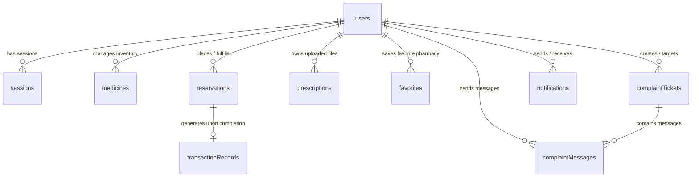

# MediVault Project Structure & Architectural Documentation

## Executive Overview
**MediVault** is a digital healthcare platform that connects customers, pharmacists, and platform administrators. It provides medicine search, prescription-backed reservation, real-time customer-pharmacist-admin support chat, inventory tracking, financial transaction recording, and AI health assistant capabilities (RAG symptom search & OCR prescription reading).

---

## Table of Contents
1. [Technology Stack & System Architecture](#1-technology-stack--system-architecture)
2. [Database Schema & Data Models](#2-database-schema--data-models)
3. [Authentication & Session Management](#3-authentication--session-management)
4. [UI Structure & User Roles](#4-ui-structure--user-roles)
5. [Backend Functions & Logic Breakdown](#5-backend-functions--logic-breakdown)
6. [Dummy Data & Seeding System](#6-dummy-data--seeding-system)
7. [Core Features & Business Workflows](#7-core-features--business-workflows)
8. [Data Transfer Routes & End-to-End Data Traversal](#8-data-transfer-routes--end-to-end-data-traversal)
9. [UI & Database Communication Protocol](#9-ui--database-communication-protocol)
10. [File Map & Directory Responsibilities](#10-file-map--directory-responsibilities)

---

## 1. Technology Stack & System Architecture

```
                               ┌───────────────────────────────────────────────┐
                               │           Browser / User Client               │
                               │  (Svelte 5 + SvelteKit 2 + Tailwind CSS v4)   │
                               └──────┬─────────────────────────┬──────────────┘
                                      │                         │
                       httpOnly Cookie│                         │ WebSocket / HTTP
                          Validation  │                         │ Client Queries & Mutations
                                      ▼                         ▼
┌───────────────────────────────────────────┐         ┌───────────────────────────────────┐
│     SvelteKit Server (hooks.server.ts)    │         │       Convex Backend Cloud        │
│ ───────────────────────────────────────── │         │ ───────────────────────────────── │
│  - Validates session tokens via cookie    │         │  - Realtime Reactive Database     │
│  - Runs SSR queries using convexServer    │         │  - PBKDF2 Password Verification   │
│  - Provides server load data to routes    │         │  - RAG Medicine Search Query      │
└───────────────────────────────────────────┘         └───────────────────────────────────┘
```

### Core Technologies
- **Frontend Framework:** SvelteKit 2 with Svelte 5 (utilizing Svelte 5 Runes `$state`, `$derived`, `$props`).
- **Styling & UI Components:** Tailwind CSS v4, Bits UI, Lucide Svelte, Vaul Svelte, Svelte Sonner.
- **Backend & Database:** Convex (realtime backend-as-a-service database, actions, queries, mutations).
- **Authentication:** Web Crypto PBKDF2-SHA256 password hashing with server-managed `httpOnly` session cookies.
- **AI RAG & Chatbot System:** Clinical RAG (Retrieval-Augmented Generation) medicine retriever with symptom synonym expansion, drug-drug contraindication engine, OpenRouter (`openrouter/auto`) & Google Gemini Free API handlers, and OCR prescription analyzer. Accessible via dedicated page ([`/ai-assistant`](file:///c:/Users/toron/OneDrive/Desktop/MediVault_workspace/MediVault/src/routes/(app)/ai-assistant/+page.svelte)) and global floating widget ([`AiChatWidget.svelte`](file:///c:/Users/toron/OneDrive/Desktop/MediVault_workspace/MediVault/src/lib/components/AiChatWidget.svelte)).

---

## 2. Database Schema & Data Models (`convex/schema.ts`)

The backend schema defines **9 main database tables**:



### Schema Implementation Code (`convex/schema.ts`)

```typescript
import { defineSchema, defineTable } from "convex/server";
import { v } from "convex/values";

export default defineSchema({
  // 1. USERS TABLE
  users: defineTable({
    name: v.optional(v.string()),
    role: v.union(v.literal("admin"), v.literal("pharmacist"), v.literal("customer")),
    email: v.string(), // Lowercased and trimmed for exact index lookup
    phone: v.optional(v.string()),
    passwordHash: v.optional(v.string()), // Format: pbkdf2$<iterations>$<saltB64>$<hashB64>
    imageUrl: v.optional(v.string()),
    isActive: v.boolean(),
    shopName: v.optional(v.string()),
    shopAddress: v.optional(v.string()),
    operatingHours: v.optional(v.string()),
    description: v.optional(v.string()),
    rating: v.optional(v.number()),
  })
    .index("by_email", ["email"])
    .index("by_role", ["role"]),

  // 1b. SESSIONS TABLE (Backs httpOnly cookie issued by SvelteKit server)
  sessions: defineTable({
    token: v.string(),
    userId: v.id("users"),
    expiresAt: v.number(),
    createdAt: v.number(),
  })
    .index("by_token", ["token"])
    .index("by_user", ["userId"]),

  // 2. MEDICINE CATALOG TABLE
  medicines: defineTable({
    name: v.string(),
    genericName: v.string(),
    description: v.string(),
    imageUrl: v.optional(v.string()),
    symptoms: v.array(v.string()),
    requiresPrescription: v.boolean(),
    stock: v.number(), // Total physical inventory on hand
    reservedQuantity: v.number(), // Locked units in active reservations
    unitCostingPrice: v.number(),
    unitSellingPrice: v.number(),
    expiryDate: v.number(),
    conflicts: v.array(v.string()), // Conflicting generic drug names
    pharmacistId: v.optional(v.id("users")),
  })
    .index("by_genericName", ["genericName"])
    .index("by_pharmacist", ["pharmacistId"]),

  // 3. RESERVATIONS TABLE
  reservations: defineTable({
    customerId: v.id("users"),
    pharmacistId: v.optional(v.id("users")),
    medsList: v.array(
      v.object({
        medicineId: v.string(),
        quantity: v.number(),
      })
    ),
    totalUnitsRequested: v.number(),
    totalCosting: v.number(),
    createdAt: v.number(),
    pickupDate: v.number(),
    prescriptionImageUrl: v.optional(v.string()),
    status: v.union(
      v.literal("pending"),
      v.literal("approved"),
      v.literal("completed"),
      v.literal("cancelled")
    ),
  })
    .index("by_customer", ["customerId"])
    .index("by_pharmacist", ["pharmacistId"])
    .index("by_status", ["status"])
    .index("by_pickupDate", ["pickupDate"]),

  // 4. TRANSACTION RECORD TABLE (Immutable sales ledger snapshot)
  transactionRecords: defineTable({
    reservationId: v.id("reservations"),
    completedAt: v.number(),
    itemsSnapshot: v.array(
      v.object({
        medicineId: v.string(),
        quantity: v.number(),
        unitCostingPriceAtSale: v.number(),
        unitSellingPriceAtSale: v.number(),
      })
    ),
    totalRevenue: v.number(),
  })
    .index("by_reservation", ["reservationId"]),
});
```

---

## 3. Authentication & Session Management

Authentication relies on **Web Crypto PBKDF2-SHA256** password hashing and **`httpOnly` cookie-backed sessions**.

```
  [User Login Form] ──POST /api/auth/login──► [SvelteKit Endpoint] ──Action signIn──► [Convex Backend]
                                                                                            │
  [Browser Storage] ◄── Set-Cookie: medivault_session=token ◄── Return session token ───────┘
```

### 1. Password Hashing (`convex/auth.ts`)
```typescript
const PBKDF2_ITERATIONS = 100_000;
const SALT_BYTES = 16;
const KEY_BITS = 256;

async function derive(password: string, salt: Uint8Array<ArrayBuffer>, iterations: number): Promise<Uint8Array> {
  const key = await crypto.subtle.importKey(
    "raw",
    new TextEncoder().encode(password),
    "PBKDF2",
    false,
    ["deriveBits"]
  );
  const bits = await crypto.subtle.deriveBits(
    { name: "PBKDF2", salt, iterations, hash: "SHA-256" },
    key,
    KEY_BITS
  );
  return new Uint8Array(bits);
}

export async function hashPassword(password: string): Promise<string> {
  const salt = crypto.getRandomValues(new Uint8Array(SALT_BYTES));
  const hash = await derive(password, salt, PBKDF2_ITERATIONS);
  return `pbkdf2$${PBKDF2_ITERATIONS}$${toBase64(salt)}$${toBase64(hash)}`;
}
```

### 2. Session Cookie issuing (`src/lib/server/session.ts`)
```typescript
export const SESSION_COOKIE = 'medivault_session';

export function setSessionCookie(cookies: Cookies, token: string, expiresAt: number) {
  cookies.set(SESSION_COOKIE, token, {
    path: '/',
    httpOnly: true,
    sameSite: 'lax',
    secure: !dev,
    maxAge: Math.max(0, Math.floor((expiresAt - Date.now()) / 1000))
  });
}
```

### 3. Server Request Hook (`src/hooks.server.ts`)
```typescript
export const handle: Handle = async ({ event, resolve }) => {
  const token = event.cookies.get(SESSION_COOKIE);
  event.locals.user = null;

  if (token) {
    try {
      const user = (await convexServer.query(api.auth.getSession, { token })) as SessionUser | null;
      if (user) {
        event.locals.user = user;
      } else {
        clearSessionCookie(event.cookies);
      }
    } catch (err) {
      console.error('[auth] session lookup failed:', err);
    }
  }

  return resolve(event);
};
```

---

## 4. UI Structure & User Roles

```
src/routes/
├── (public)/                 # Accessible to all users
│   ├── +page.svelte          # Landing page & medicine search
│   └── pharmacy/[id]/        # Public pharmacy details view
├── (auth)/                   # Unauthenticated authentication pages
│   ├── login/                # User login form
│   ├── register/             # Account creation (Customer / Pharmacist)
│   └── forgot-password/      # Password recovery UI
├── (app)/                    # Protected Customer portal layout
│   ├── dashboard/            # Customer overview dashboard
│   ├── pharmacy/             # Pharmacy directory & filtering
│   ├── reservations/         # Order tracking & reservation creation
│   ├── prescriptions/        # Uploaded prescription document vault
│   ├── favorites/            # Saved favorite pharmacies
│   ├── complaint/            # Customer support tickets & chat
│   ├── notification/         # Notification inbox
│   └── ai-assistant/         # AI symptom check & RAG health guide
├── (pharmacist)/             # Protected Pharmacist management portal
│   ├── pharmacist/dashboard/ # Pharmacy statistics & alerts
│   ├── pharmacist/approvals/ # Orders pending pharmacist review
│   ├── pharmacist/delivery/  # Approved orders ready for customer pickup
│   ├── pharmacist/inventory/ # Store inventory management (CRUD)
│   └── pharmacist/transaction_records/ # Completed sales financial ledger
└── (admin)/                  # Protected Administrator control portal
    ├── admin/dashboard/      # System-wide metrics & overall revenue
    ├── admin/users/          # Customer account management & toggle active
    ├── admin/pharmacists/    # Pharmacist approval & store management
    ├── admin/medicines/      # Master medicine catalog oversight
    ├── admin/Recieved_com/   # System-wide support tickets & chat monitor
    └── admin/reports/        # System reporting analytics
```

### Route Guard Example (`src/routes/(app)/+layout.server.ts`)
```typescript
import { requireRole } from '$lib/server/session';
import type { LayoutServerLoad } from './$types';

export const load: LayoutServerLoad = async ({ locals, url }) => {
  const user = requireRole(locals.user, ['customer', 'pharmacist', 'admin'], url);
  return { user };
};
```

---

## 5. Backend Functions & Logic Breakdown

### Key Backend Mutations & Queries

#### 1. Reserving Medicine & Adjusting Inventory (`convex/reservations.ts`)
```typescript
export const create = mutation({
  args: {
    customerId: v.optional(v.id("users")),
    medsList: v.array(v.object({ medicineId: v.string(), quantity: v.number() })),
    pickupDate: v.number(),
    prescriptionImageUrl: v.optional(v.string()),
  },
  handler: async (ctx, args) => {
    let totalUnits = 0;
    let totalCosting = 0;

    for (const item of args.medsList) {
      const med = await ctx.db.get("medicines", item.medicineId as Id<"medicines">);
      if (!med) throw new Error("Medicine not found");
      
      const available = med.stock - med.reservedQuantity;
      if (available < item.quantity) {
        throw new Error(`Insufficient stock for ${med.name}`);
      }

      // Lock reserved quantity
      await ctx.db.patch("medicines", med._id, {
        reservedQuantity: med.reservedQuantity + item.quantity,
      });

      totalUnits += item.quantity;
      totalCosting += item.quantity * med.unitSellingPrice;
    }

    return await ctx.db.insert("reservations", {
      customerId: args.customerId,
      medsList: args.medsList,
      totalUnitsRequested: totalUnits,
      totalCosting,
      createdAt: Date.now(),
      pickupDate: args.pickupDate,
      prescriptionImageUrl: args.prescriptionImageUrl,
      status: "pending",
    });
  },
});
```

#### 2. Completing Sale & Creating Financial Snapshot (`convex/reservations.ts`)
```typescript
export const complete = mutation({
  args: { reservationId: v.id("reservations") },
  handler: async (ctx, args) => {
    const reservation = await ctx.db.get("reservations", args.reservationId);
    if (!reservation) throw new Error("Reservation not found");

    const itemsSnapshot = [];
    let totalRevenue = 0;

    for (const item of reservation.medsList) {
      const med = await ctx.db.get("medicines", item.medicineId as Id<"medicines">);
      if (med) {
        // Deduct both physical stock and reserved count
        await ctx.db.patch("medicines", med._id, {
          stock: Math.max(0, med.stock - item.quantity),
          reservedQuantity: Math.max(0, med.reservedQuantity - item.quantity),
        });

        itemsSnapshot.push({
          medicineId: item.medicineId,
          quantity: item.quantity,
          unitCostingPriceAtSale: med.unitCostingPrice,
          unitSellingPriceAtSale: med.unitSellingPrice,
        });
        totalRevenue += item.quantity * med.unitSellingPrice;
      }
    }

    await ctx.db.patch("reservations", args.reservationId, { status: "completed" });

    // Store immutable financial ledger record
    await ctx.db.insert("transactionRecords", {
      reservationId: args.reservationId,
      completedAt: Date.now(),
      itemsSnapshot,
      totalRevenue,
    });
  },
});
```

#### 3. RAG Clinical Knowledge Base Search (`convex/rag.ts`)
```typescript
export const searchMedicineKnowledgeBase = query({
  args: { query: v.string() },
  handler: async (ctx, args) => {
    const rawQuery = args.query.trim().toLowerCase();
    const allMedicines = await ctx.db.query("medicines").collect();
    const words = rawQuery.split(/\s+/).filter((w) => w.length > 2);
    const scoredMedicines = [];
    const detectedConflicts = [];

    // Symptom Synonym Expansion Engine
    const expandedTerms = new Set(words);
    expandedTerms.add(rawQuery);
    for (const [symptom, syns] of Object.entries(SYMPTOM_SYNONYMS)) {
      if (rawQuery.includes(symptom)) syns.forEach((s) => expandedTerms.add(s));
    }

    for (const med of allMedicines) {
      let score = 0;
      // 1. Generic & Brand Name Exact/Partial Matching (Highest weight)
      if (rawQuery.includes(med.genericName.toLowerCase())) score += 25;
      if (rawQuery.includes(med.name.toLowerCase())) score += 20;

      // 2. Symptom Matching with Synonym Expansion (+20 direct, +10 synonym)
      for (const symptom of med.symptoms) {
        if (rawQuery.includes(symptom.toLowerCase())) {
          score += 20;
        } else {
          for (const term of expandedTerms) {
            if (symptom.toLowerCase().includes(term)) { score += 10; break; }
          }
        }
      }

      // 3. Drug Contraindication / Interaction Check
      for (const conflict of med.conflicts) {
        if (rawQuery.includes(conflict.toLowerCase())) {
          detectedConflicts.push(`⚠️ Contraindication Warning: ${med.name} conflicts with ${conflict}`);
        }
      }

      if (score > 0) scoredMedicines.push({ ...med, relevanceScore: score });
    }

    scoredMedicines.sort((a, b) => b.relevanceScore - a.relevanceScore);
    return {
      medicines: scoredMedicines.slice(0, 6),
      conflictAlerts: Array.from(new Set(detectedConflicts)),
      ragContextText: formatRagContext(scoredMedicines.slice(0, 6))
    };
  },
});
```

---

## 6. Dummy Data & Seeding System

### Seeding Implementation (`convex/seed.ts`)
```typescript
export const seedFromDummyData = internalMutation({
  args: { users: v.array(...) },
  handler: async (ctx, args) => {
    // 1. Wipe all existing tables atomically
    const tables = ["transactionRecords", "notifications", "complaintMessages", "complaintTickets", "favorites", "prescriptions", "reservations", "medicines", "users"] as const;
    for (const table of tables) {
      const docs = await ctx.db.query(table).collect();
      for (const doc of docs) await ctx.db.delete(doc._id);
    }

    // 2. Insert Users and build ID mapping dictionary
    const userIdMap: Record<string, Id<"users">> = {};
    for (const u of args.users) {
      const insertedId = await ctx.db.insert("users", { ...u });
      userIdMap[u.dummyId] = insertedId;
    }

    // 3. Insert Medicines and build Medicine ID map
    const medIdMap: Record<string, Id<"medicines">> = {};
    for (const med of dummyData.medicines) {
      const pharmacistId = med.pharmacistId ? userIdMap[med.pharmacistId] : undefined;
      const insertedId = await ctx.db.insert("medicines", { ...med, pharmacistId });
      medIdMap[med._id] = insertedId;
    }

    // 4. Re-link and insert Reservations, Tickets, and Messages
    // ...
    return "Database successfully seeded from dummyData.json!";
  },
});
```

---

## 7. Core Features & Business Workflows

### 1. Reservation & Inventory Control Workflow
```
 [Customer Checkout] ──► Status: "pending" (Adds count to reservedQuantity)
                                 │
 [Pharmacist Review] ────► Status: "approved" (Ready for pickup)
                                 │
  ┌──────────────────────────────┴──────────────────────────────┐
  ▼                                                             ▼
[Pickup Completed]                                    [Order Cancelled / Expired]
- Status: "completed"                                 - Status: "cancelled"
- Deducts physical stock                              - Subtracts reservedQuantity
- Records immutable financial ledger                  - Restores available inventory
```

---

## 8. Data Transfer Routes & End-to-End Data Traversal

This section maps out step-by-step how data travels from file to file across user interactions:

### Route 1: User Login & Session Hydration Flow

```
[src/lib/components/login-form.svelte]
          │  1. Form Submit (email, password)
          ▼
[src/routes/(auth)/login/+page.server.ts]
          │  2. Execute action `convexServer.action(api.auth.signIn, { email, password })`
          ▼
[convex/auth.ts (signIn action)]
          │  3. Query `users` table via `getUserByEmail` index lookup
          │  4. Verify PBKDF2 hash using `verifyPassword(...)`
          │  5. Insert new session into `sessions` table in Convex DB
          ▼
[src/routes/(auth)/login/+page.server.ts]
          │  6. Receive token & call `setSessionCookie(cookies, token, expiresAt)`
          ▼
[src/lib/server/session.ts] ──► [Browser Cookie: medivault_session]
                                            │
                                            │ (7. Next HTTP Request sent by Browser)
                                            ▼
                             [src/hooks.server.ts]
                                            │  8. Read cookie & query `api.auth.getSession`
                                            │  9. Populate `event.locals.user`
                                            ▼
                             [src/routes/+layout.server.ts]
                                            │ 10. Pass `{ user: locals.user }` to Page Data
                                            ▼
                             [src/lib/session.svelte.ts] ──► Reads `page.data.user` for UI
```

---

### Route 2: Medicine Reservation & Order Fulfillment Flow

```
[src/routes/(app)/reservations/+page.svelte]
          │  1. User selects medicine & submits reservation
          ▼
[convex/reservations.ts (create mutation)]
          │  2. Fetch target medicine from `medicines` table
          │  3. Verify stock: `stock - reservedQuantity >= quantity`
          │  4. Patch `medicines` table: `reservedQuantity += quantity`
          │  5. Insert record into `reservations` table (status = "pending")
          ▼
   [Convex Realtime Database Cloud]
          │
          ├──────────────────────────────────────────────────┐ (Realtime WebSocket Push)
          ▼                                                  ▼
[src/routes/(pharmacist)/pharmacist/approvals/+page.svelte] [src/routes/(app)/reservations/+page.svelte]
          │  (Displays new order)                                   (Displays order status: "pending")
          │  6. Pharmacist clicks "Approve"
          ▼
[convex/reservations.ts (approve mutation)]
          │  7. Patch `reservations` table (status = "approved")
          │  8. Call `convex/notifications.ts` (`sendNotification`)
          ▼
[src/routes/(app)/notification/+page.svelte] ◄── Customer receives "Order Approved" ping
          │
          │  9. Customer picks up medicine at pharmacy
          ▼
[src/routes/(pharmacist)/pharmacist/delivery/+page.svelte]
          │ 10. Pharmacist clicks "Mark Completed"
          ▼
[convex/reservations.ts (complete mutation)]
          │ 11. Patch `reservations` table (status = "completed")
          │ 12. Update `medicines`: `stock -= qty`, `reservedQuantity -= qty`
          │ 13. Insert snapshot into `transactionRecords` table
          ▼
[src/routes/(admin)/admin/dashboard/+page.svelte] ◄── Updates total revenue analytics
```

---

### Route 3: Support Ticket & Realtime Chat Flow

```
[src/routes/(app)/complaint/+page.svelte]
          │  1. Customer fills out ticket title & message
          ▼
[convex/complaints.ts (createTicket mutation)]
          │  2. Insert ticket into `complaintTickets` table (status = "open")
          │  3. Insert initial text into `complaintMessages` table
          ▼
   [Convex Realtime Engine]
          │
          │  (WebSocket Subscription: `useQuery(api.complaints.getTicketWithMessages)`)
          ▼
[src/routes/(admin)/admin/Recieved_com/+page.svelte]
          │  4. Realtime alert notifies Admin / Pharmacist of incoming message
          │  5. Admin types response and calls `sendMessage` mutation
          ▼
[convex/complaints.ts (sendMessage mutation)]
          │  6. Insert new message into `complaintMessages` table
          │  7. Patch `complaintTickets`: `updatedAt = Date.now()`
          ▼
[src/routes/(app)/complaint/+page.svelte] ◄── Instant message appearance in customer chat window
```

---

### Route 4: AI Health Assistant RAG Search & Chatbot Flow

```
[src/routes/(app)/ai-assistant/+page.svelte] OR [src/lib/components/AiChatWidget.svelte]
          │  1. User enters symptoms: "What medicine relieves fever and acid reflux?"
          ▼ (HTTP POST JSON)
[src/routes/api/ai/chat/+server.ts]
          │  2. Execute query `convexServer.query(api.rag.searchMedicineKnowledgeBase, { query })`
          ▼
[convex/rag.ts (searchMedicineKnowledgeBase query)]
          │  3. Query `medicines` table for catalog items
          │  4. Apply Symptom Synonym Expansion Engine (fever -> pyrexia; acidity -> heartburn/gastric)
          │  5. Score items against query symptoms, generic names, brand names
          │  6. Check contraindication warnings (e.g., Warfarin conflicts)
          │  7. Format structured `ragContextText` containing top matching medicines & contraindications
          ▼
[src/routes/api/ai/chat/+server.ts]
          │  8. Inject `ragContextText` into LLM System Prompt
          │  9. Multi-LLM Provider Selection:
          │     ├── Option A: Google Gemini Free API (GEMINI_API_KEY)
          │     ├── Option B: OpenRouter API (OPENROUTER_API_KEY, openrouter/auto)
          │     └── Option C: Offline Convex Clinical RAG Engine (built-in fallback)
          │ 10. Extract AI clinical response text & parse <suggested_medicines> JSON block
          ▼
[UI Layer (AI Assistant / AiChatWidget)]
          │ 11. Render AI Response text with formatting
          │ 12. Display interactive Medicine Suggestion Cards (Name, Generic, Price, OTC/Rx tag)
          └─► 13. User clicks medicine card -> navigate to Pharmacy Inventory Search
```

---

## 9. UI & Database Communication Protocol

MediVault connects Svelte 5 components to the Convex backend using `convex-svelte` subscriptions:

### Reactive Svelte 5 Query Component Example
```svelte
<script lang="ts">
  import { useQuery } from 'convex-svelte';
  import { api } from '$convex/_generated/api';

  let searchQuery = $state('');
  
  // Realtime subscription query: automatically re-evaluates when DB changes
  const medicinesQuery = useQuery(api.medicines.list, () => ({
    searchQuery,
    inStockOnly: true
  }));
</script>

<input type="text" bind:value={searchQuery} placeholder="Search medicines or symptoms..." />

{#if medicinesQuery.isLoading}
  <p>Loading medicines...</p>
{:else if medicinesQuery.data}
  <div class="grid gap-4">
    {#each medicinesQuery.data as med}
      <div class="p-4 border rounded-lg">
        <h3 class="font-bold">{med.name} ({med.genericName})</h3>
        <p>{med.description}</p>
        <span class="text-green-600">${med.unitSellingPrice}</span>
      </div>
    {/each}
  </div>
{/if}
```

### Server Session Context (`src/lib/session.svelte.ts`)
```typescript
import { page } from '$app/state';
import type { SessionUser } from '$lib/roles';

class UserSession {
  get user(): SessionUser | null {
    return (page.data.user as SessionUser | null | undefined) ?? null;
  }
  get role(): string {
    return this.user?.role ?? 'customer';
  }
  get isLoggedIn(): boolean {
    return this.user !== null;
  }
}

export const userSession = new UserSession();
```

---

## 10. File Map & Directory Responsibilities

### Root & Configuration Files
- [`package.json`](file:///c:/Users/toron/OneDrive/Desktop/MediVault_workspace/MediVault/package.json): Workspace dependencies, scripts (`dev`, `build`, `seed`, `check`, `test`).
- [`vite.config.ts`](file:///c:/Users/toron/OneDrive/Desktop/MediVault_workspace/MediVault/vite.config.ts): Vite build configuration with SvelteKit and Tailwind CSS v4.
- [`.env.local`](file:///c:/Users/toron/OneDrive/Desktop/MediVault_workspace/MediVault/.env.local): Environment configuration keys (Convex URLs, `OPENROUTER_API_KEY`, `OPENROUTER_MODEL`).
- [`RAG_AI_CHATBOT_DOCUMENTATION.md`](file:///c:/Users/toron/OneDrive/Desktop/MediVault_workspace/MediVault/RAG_AI_CHATBOT_DOCUMENTATION.md): Detailed architectural documentation for RAG & AI Chatbot system.

### Backend Files (`convex/`)
- [`convex/schema.ts`](file:///c:/Users/toron/OneDrive/Desktop/MediVault_workspace/MediVault/convex/schema.ts): Database tables, index definitions, and schema validation.
- [`convex/auth.ts`](file:///c:/Users/toron/OneDrive/Desktop/MediVault_workspace/MediVault/convex/auth.ts): Authentication actions, PBKDF2 password hashing, and session management.
- [`convex/medicines.ts`](file:///c:/Users/toron/OneDrive/Desktop/MediVault_workspace/MediVault/convex/medicines.ts): Medicine inventory queries and CRUD mutations.
- [`convex/reservations.ts`](file:///c:/Users/toron/OneDrive/Desktop/MediVault_workspace/MediVault/convex/reservations.ts): Order creation, approval, completion, and stock reservation logic.
- [`convex/complaints.ts`](file:///c:/Users/toron/OneDrive/Desktop/MediVault_workspace/MediVault/convex/complaints.ts): Complaint ticket engine and 1-on-1 chat message queries/mutations.
- [`convex/admin.ts`](file:///c:/Users/toron/OneDrive/Desktop/MediVault_workspace/MediVault/convex/admin.ts): Platform administrative analytics and moderation functions.
- [`convex/rag.ts`](file:///c:/Users/toron/OneDrive/Desktop/MediVault_workspace/MediVault/convex/rag.ts): Knowledge base RAG retriever with synonym expansion, scoring, and contraindications.
- [`convex/seed.ts`](file:///c:/Users/toron/OneDrive/Desktop/MediVault_workspace/MediVault/convex/seed.ts): Seeding action script for database bootstrapping.

### Frontend Files (`src/`)
- [`src/hooks.server.ts`](file:///c:/Users/toron/OneDrive/Desktop/MediVault_workspace/MediVault/src/hooks.server.ts): SvelteKit server hook handling session token verification on every request.
- [`src/lib/convexClient.ts`](file:///c:/Users/toron/OneDrive/Desktop/MediVault_workspace/MediVault/src/lib/convexClient.ts): Browser `ConvexClient` instance.
- [`src/lib/session.svelte.ts`](file:///c:/Users/toron/OneDrive/Desktop/MediVault_workspace/MediVault/src/lib/session.svelte.ts): Svelte 5 reactive session state wrapper reading `page.data.user`.
- [`src/lib/server/session.ts`](file:///c:/Users/toron/OneDrive/Desktop/MediVault_workspace/MediVault/src/lib/server/session.ts): Server-side HTTP cookie setup and role guard logic.
- [`src/lib/components/AiChatWidget.svelte`](file:///c:/Users/toron/OneDrive/Desktop/MediVault_workspace/MediVault/src/lib/components/AiChatWidget.svelte): Global floating AI Chatbot widget component mounted in app layout.
- [`src/routes/api/ai/chat/+server.ts`](file:///c:/Users/toron/OneDrive/Desktop/MediVault_workspace/MediVault/src/routes/api/ai/chat/+server.ts): Server endpoint connecting RAG retriever to OpenRouter / Gemini LLM APIs and offline fallback.
- [`src/routes/(app)/ai-assistant/+page.svelte`](file:///c:/Users/toron/OneDrive/Desktop/MediVault_workspace/MediVault/src/routes/(app)/ai-assistant/+page.svelte): Full AI Assistant workspace with chat, quick prompts, and OCR prescription reader.
- [`src/lib/utils/ragAiChatbot.test.ts`](file:///c:/Users/toron/OneDrive/Desktop/MediVault_workspace/MediVault/src/lib/utils/ragAiChatbot.test.ts): Unit tests verifying symptom matching, drug conflict warnings, and suggested medicine parsing.

