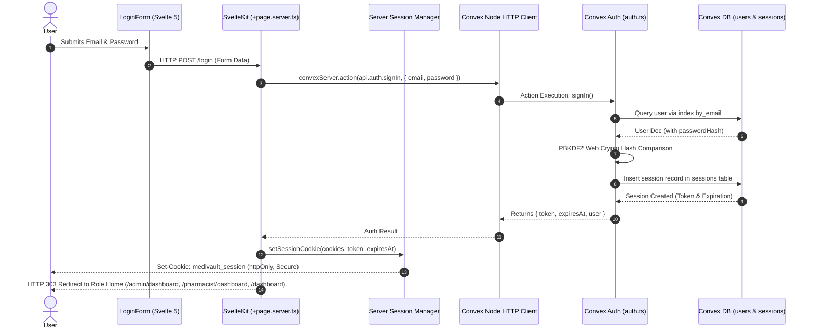
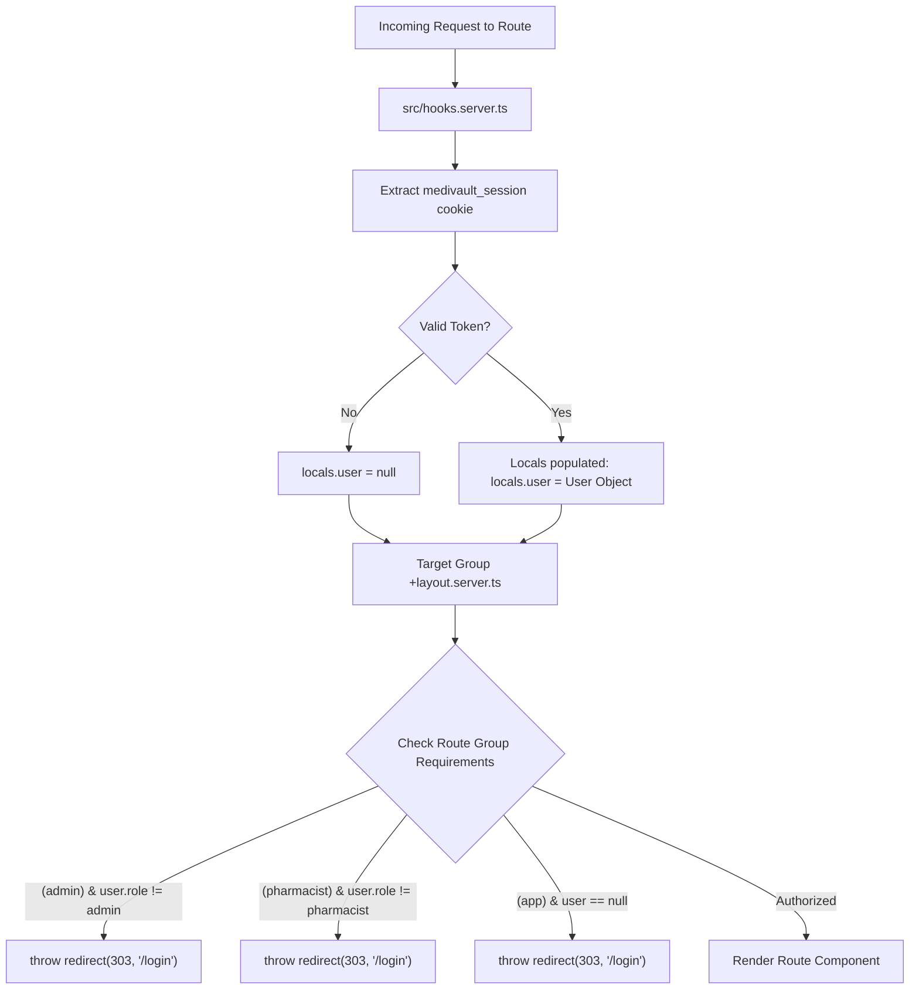
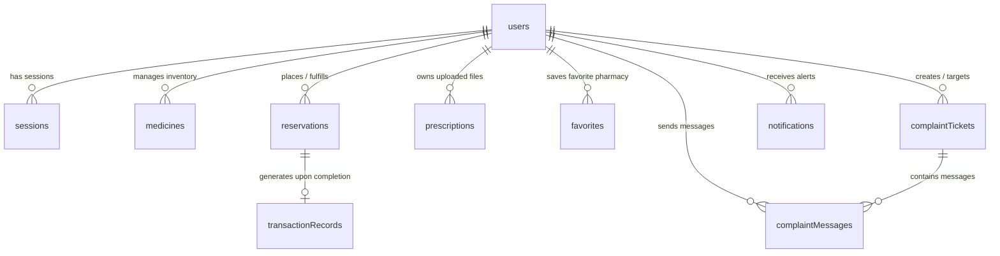

# MediVault Communication Topology & Function Call Reference
*A Comprehensive Viva Defense & Architectural Blueprint*

---

## Overview

This document presents the **exact file-to-file topology**, **communication protocols**, **data flows**, and **function call call-stacks** across all key sectors of the MediVault platform. It is specifically structured for academic presentation and viva examinations, detailing how the frontend UI (SvelteKit 2 / Svelte 5), backend cloud runtime (Convex BaaS), HTTP server endpoints, and external AI services interact.

---

## Table of Sectors

1. [Sector 1: Admin CRUD Operations for User Management](#sector-1-admin-crud-operations-for-user-management)
2. [Sector 2: Authentication & Login Logic](#sector-2-authentication--login-logic)
3. [Sector 3: UI Design System & Dynamic Color Changing](#sector-3-ui-design-system--dynamic-color-changing)
4. [Sector 4: Messaging & Complaint Ticket System](#sector-4-messaging--complaint-ticket-system)
5. [Sector 5: OCR Integration & Clinical RAG Engine](#sector-5-ocr-integration--clinical-rag-engine)
6. [Sector 6: SvelteKit Routing & Role-Based Access Control](#sector-6-sveltekit-routing--role-based-access-control)
7. [Sector 7: Convex Connection Architecture & Database Schema](#sector-7-convex-connection-architecture--database-schema)

---

## Sector 1: Admin CRUD Operations for User Management

### 1. Architectural Topology & Components

```
┌─────────────────────────────────────────────────────────────┐
│                 Frontend UI Component                       │
│    src/routes/(admin)/admin/users/+page.svelte              │
└──────────────┬──────────────────────────────▲───────────────┘
               │                              │
  Query /      │ convex.query()               │ WebSocket Live Update
  Mutation     │ convex.mutation()            │ convex.onUpdate()
               ▼                              │
┌─────────────────────────────────────────────────────────────┐
│              Client-side Convex Client                      │
│              src/lib/convexClient.ts                        │
└──────────────┬──────────────────────────────▲───────────────┘
               │                              │
               │ WSS (WebSocket Secure)       │ Reactive Push
               ▼                              │
┌─────────────────────────────────────────────────────────────┐
│                Convex Backend Module                        │
│                 convex/admin.ts                             │
└──────────────┬──────────────────────────────────────────────┘
               │
               │ Database Operations (ctx.db)
               ▼
┌─────────────────────────────────────────────────────────────┐
│                Convex Database Table                        │
│                users (defined in schema.ts)                 │
└─────────────────────────────────────────────────────────────┘
```

### 2. File & Function Call Matrix

| Action | Source File & Function | Target Backend API | Convex Database Function / Index |
| :--- | :--- | :--- | :--- |
| **Fetch Users** | `fetchUsers()` in [users/+page.svelte](file:///c:/Users/toron/OneDrive/Desktop/MediVault_workspace/MediVault/src/routes/(admin)/admin/users/+page.svelte) | `convex.query(api.admin.listUsers, { role, searchQuery })` | `listUsers` in [convex/admin.ts](file:///c:/Users/toron/OneDrive/Desktop/MediVault_workspace/MediVault/convex/admin.ts) using `by_role` index |
| **Live Sync** | `onMount()` in [users/+page.svelte](file:///c:/Users/toron/OneDrive/Desktop/MediVault_workspace/MediVault/src/routes/(admin)/admin/users/+page.svelte) | `convex.onUpdate(api.admin.listUsers, {}, callback)` | Real-time WebSocket subscription handler in [convexClient.ts](file:///c:/Users/toron/OneDrive/Desktop/MediVault_workspace/MediVault/src/lib/convexClient.ts) |
| **Create User** | `saveUser()` in [users/+page.svelte](file:///c:/Users/toron/OneDrive/Desktop/MediVault_workspace/MediVault/src/routes/(admin)/admin/users/+page.svelte) | `convex.mutation(api.admin.createUser, { email, role, name, phone, isActive })` | `createUser` in [convex/admin.ts](file:///c:/Users/toron/OneDrive/Desktop/MediVault_workspace/MediVault/convex/admin.ts) executing `ctx.db.insert("users", ...)` |
| **Update User** | `saveUser()` in [users/+page.svelte](file:///c:/Users/toron/OneDrive/Desktop/MediVault_workspace/MediVault/src/routes/(admin)/admin/users/+page.svelte) | `convex.mutation(api.admin.updateUser, { userId, email, role, name, phone, isActive })` | `updateUser` in [convex/admin.ts](file:///c:/Users/toron/OneDrive/Desktop/MediVault_workspace/MediVault/convex/admin.ts) executing `ctx.db.patch(args.userId, ...)` |
| **Toggle Status**| `toggleUserStatus()` in [users/+page.svelte](file:///c:/Users/toron/OneDrive/Desktop/MediVault_workspace/MediVault/src/routes/(admin)/admin/users/+page.svelte) | `convex.mutation(api.admin.toggleUserStatus, { userId, isActive })` | `toggleUserStatus` in [convex/admin.ts](file:///c:/Users/toron/OneDrive/Desktop/MediVault_workspace/MediVault/convex/admin.ts) executing `ctx.db.patch(args.userId, { isActive })` |
| **Delete User** | `confirmDelete()` in [users/+page.svelte](file:///c:/Users/toron/OneDrive/Desktop/MediVault_workspace/MediVault/src/routes/(admin)/admin/users/+page.svelte) | `convex.mutation(api.admin.deleteUser, { userId })` | `deleteUser` in [convex/admin.ts](file:///c:/Users/toron/OneDrive/Desktop/MediVault_workspace/MediVault/convex/admin.ts) executing `ctx.db.delete(args.userId)` |

### 3. Viva Defense Explanation Points

1. **Reactive Subscription Pattern:** Explain to the teacher that `fetchUsers()` serves as an initial fetch, but `convex.onUpdate(api.admin.listUsers, ...)` keeps the state automatically updated across all open browser instances without requiring manual page refreshes or polling.
2. **Index Optimization:** In `convex/admin.ts`, when an admin filters by role (e.g. `role: "pharmacist"`), Convex executes `ctx.db.query("users").withIndex("by_role", (q) => q.eq("role", roleFilter))` which avoids full table scans.
3. **Data Normalization:** In `createUser`, the backend enforces lowercase email normalization (`args.email.trim().toLowerCase()`) and checks uniqueness against index `by_email` before insertion.

---

## Sector 2: Authentication & Login Logic

### 1. Architectural Topology & Sequence



### 2. File & Function Call Pipeline

1. **Client Form Render:** [src/lib/components/login-form.svelte](file:///c:/Users/toron/OneDrive/Desktop/MediVault_workspace/MediVault/src/lib/components/login-form.svelte) rendered inside [src/routes/(auth)/login/+page.svelte](file:///c:/Users/toron/OneDrive/Desktop/MediVault_workspace/MediVault/src/routes/(auth)/login/+page.svelte).
2. **Server Action Interceptor:** [src/routes/(auth)/login/+page.server.ts](file:///c:/Users/toron/OneDrive/Desktop/MediVault_workspace/MediVault/src/routes/(auth)/login/+page.server.ts)
   - Function: `actions.default`
   - Intercepts POST data (`email`, `password`, `redirectTo`).
   - Invokes backend: `await convexServer.action(api.auth.signIn, { email, password })`.
3. **Convex Backend Action:** [convex/auth.ts](file:///c:/Users/toron/OneDrive/Desktop/MediVault_workspace/MediVault/convex/auth.ts)
   - Function: `signIn`
   - Calls internal query `ctx.runQuery(internal.auth.getUserByEmailInternal, { email })`.
   - Executes Web Crypto PBKDF2 derivation: `derive(password, salt, iterations)` using `crypto.subtle.importKey` and `crypto.subtle.deriveBits` (100,000 iterations).
   - Calls internal mutation `ctx.runMutation(internal.auth.createSessionInternal, { userId })` to persist session token.
4. **Cookie Provisioning:** [src/lib/server/session.ts](file:///c:/Users/toron/OneDrive/Desktop/MediVault_workspace/MediVault/src/lib/server/session.ts)
   - Function: `setSessionCookie(cookies, token, expiresAt)`
   - Sets HTTP cookie `medivault_session` with flags `httpOnly: true`, `sameSite: 'lax'`, `path: '/'`, `secure: true`.
5. **Middleware Session Verification on Every Route:** [src/hooks.server.ts](file:///c:/Users/toron/OneDrive/Desktop/MediVault_workspace/MediVault/src/hooks.server.ts)
   - Function: `handle({ event, resolve })`
   - Reads `event.cookies.get('medivault_session')`.
   - Calls `convexServer.query(api.auth.getSession, { token })`.
   - Populates server-side user context: `event.locals.user = user`.

### 3. Viva Defense Explanation Points

1. **Security Architecture (Why httpOnly?):** Explain that session tokens are never stored in `localStorage` to prevent XSS (Cross-Site Scripting) theft. The SvelteKit server reads the token from an `httpOnly` cookie and communicates with Convex server-to-server.
2. **Web Crypto Hashing:** Password verification occurs inside the Convex V8 isolate environment using Web Crypto APIs (PBKDF2-SHA256 with 100,000 iterations and salt). Raw passwords are never stored.
3. **Automatic Deactivation Check:** `getSession` in `convex/auth.ts` verifies `user.isActive`. If an administrator deactivates a user account, `getSession` instantly invalidates the session and `hooks.server.ts` clears the session cookie.

---

## Sector 3: UI Design System & Dynamic Color Changing

### 1. Architectural Topology

```
┌─────────────────────────────────────────────────────────────┐
│                   Global Style Tokens                       │
│                      src/app.css                            │
│  Defines CSS variables: --background, --primary, --accent,  │
│  data-theme="theme-1" through "theme-7", and .dark class    │
└──────────────────────────────▲──────────────────────────────┘
                               │
                               │ CSS Variable Injection
┌──────────────────────────────┴──────────────────────────────┐
│                    Root Application Layout                  │
│                  src/routes/+layout.svelte                  │
│ ─────────────────────────────────────────────────────────── │
│  - Mounts ModeWatcher for dark/light mode                   │
│  - Binds keyboard shortcut (Alt + 1..7)                     │
│  - Manages activeTheme rune state ($state)                  │
└──────────────────────────────▲──────────────────────────────┘
                               │
                               │ Method Calls
┌──────────────────────────────┴──────────────────────────────┐
│                  Reactive Theme Manager Class               │
│                    src/lib/theme.ts                         │
│ ─────────────────────────────────────────────────────────── │
│  - state: currentTheme ($state)                             │
│  - state: isDarkMode ($state)                               │
│  - changeTheme(newTheme)                                    │
│  - toggleDarkMode()                                         │
└─────────────────────────────────────────────────────────────┘
```

### 2. Exact Function Calls & State Flow

1. **Global Design System ([src/app.css](file:///c:/Users/toron/OneDrive/Desktop/MediVault_workspace/MediVault/src/app.css)):**
   - Implements HSL color palettes for 7 custom themes (`[data-theme="theme-1"]` to `[data-theme="theme-7"]`).
   - Handles Tailwind CSS v4 variables and custom glassmorphic utilities (`.glass-panel`, `.gradient-text`, `.glow-effect`).
2. **State Storage Class ([src/lib/theme.ts](file:///c:/Users/toron/OneDrive/Desktop/MediVault_workspace/MediVault/src/lib/theme.ts)):**
   - `changeTheme(newTheme: string)`:
     ```ts
     this.currentTheme = newTheme;
     localStorage.setItem('user-canvas-theme', newTheme);
     document.documentElement.setAttribute('data-theme', newTheme);
     ```
   - `toggleDarkMode()`:
     ```ts
     this.isDarkMode = !this.isDarkMode;
     localStorage.setItem('user-dark-mode', String(this.isDarkMode));
     document.documentElement.classList.toggle('dark', this.isDarkMode);
     ```
3. **Keyboard Shortcut Execution ([src/routes/+layout.svelte](file:///c:/Users/toron/OneDrive/Desktop/MediVault_workspace/MediVault/src/routes/+layout.svelte)):**
   - Function: `handleThemeShortcut(event: KeyboardEvent)` attached to `<svelte:window onkeydown={handleThemeShortcut} />`.
   - Listens for `Alt + 1` through `Alt + 7`.
   - Instantly updates `activeTheme = theme-${event.key}` and mutates `document.documentElement.setAttribute("data-theme", themeId)`.
   - Preserves dark mode status by re-applying `document.documentElement.classList.add("dark")` if currently dark.

### 3. Viva Defense Explanation Points

1. **Zero Layout Shift Theme Switching:** Theme switching does not require page reloads or API calls. Changing `data-theme` on `document.documentElement` dynamically swaps CSS variable definitions across the entire DOM tree in 1 frame (16ms).
2. **Svelte 5 Runes Integration:** `theme.ts` utilizes Svelte 5 `$state` runes within a class instance, making theme properties reactively available to any component in the application.

---

## Sector 4: Messaging & Complaint Ticket System

### 1. Architectural Topology & Flow

```
┌─────────────────────────────────────────────────────────────────────────┐
│                          Role-Based UI Pages                            │
│  Customer: src/routes/(app)/complaint/+page.svelte                      │
│  Pharmacist: src/routes/(pharmacist)/pharmacist/messages/+page.svelte   │
│  Admin: src/routes/(admin)/admin/Recieved_com/+page.svelte              │
└────────────────────────────────────┬────────────────────────────────────┘
                                     │
           Convex Reactive Queries   │ convex.query() / convex.mutation()
           & Realtime Subscriptions  │ convex.onUpdate()
                                     ▼
┌─────────────────────────────────────────────────────────────────────────┐
│                    Backend Complaint Controller Module                  │
│                        convex/complaints.ts                             │
└────────────────────────────────────┬────────────────────────────────────┘
                                     │
                                     │ Database Queries & Mutations
                                     ▼
┌─────────────────────────────────────────────────────────────────────────┐
│                      Convex Database Schema                             │
│   complaintTickets (Index: by_creator, by_target, by_status)             │
│   complaintMessages (Index: by_ticket, by_sender)                       │
└─────────────────────────────────────────────────────────────────────────┘
```

### 2. Communication Protocol & Function Calls

| Step | Function / Trigger | File Location | Operational Description |
| :--- | :--- | :--- | :--- |
| 1 | `listChattableAccounts` | [convex/complaints.ts](file:///c:/Users/toron/OneDrive/Desktop/MediVault_workspace/MediVault/convex/complaints.ts) | Enforces chat role safety: Customer cannot chat with Customer, Pharmacist cannot chat with Pharmacist, Admin cannot chat with Admin. |
| 2 | `listUserTickets` | [convex/complaints.ts](file:///c:/Users/toron/OneDrive/Desktop/MediVault_workspace/MediVault/convex/complaints.ts) | Queries 1-on-1 complaint threads relevant to user ID, supporting tab filtering (`all`, `admin_chats`, `pharmacist_chats`, `customer_chats`). |
| 3 | `createTicket` | [convex/complaints.ts](file:///c:/Users/toron/OneDrive/Desktop/MediVault_workspace/MediVault/convex/complaints.ts) | Inserts new document in `complaintTickets` table and calls `addMessage` to attach the initial text. |
| 4 | `getTicketMessages` | [convex/complaints.ts](file:///c:/Users/toron/OneDrive/Desktop/MediVault_workspace/MediVault/convex/complaints.ts) | Queries all chat messages in a thread using index `by_ticket` sorted chronologically. |
| 5 | `addMessage` | [convex/complaints.ts](file:///c:/Users/toron/OneDrive/Desktop/MediVault_workspace/MediVault/convex/complaints.ts) | Inserts message in `complaintMessages` table and updates `complaintTickets` document (`lastMessageAt`, `lastSenderRole`, status `"in-progress"`). |
| 6 | Realtime Push | Frontend UI (`+page.svelte`) | Uses `convex.onUpdate(api.complaints.getTicketMessages, { ticketId }, (msgs) => ...)` to render incoming text bubbles instantly. |

### 3. Viva Defense Explanation Points

1. **Role Separation Security:** `listChattableAccounts` inspects `currentUser.role` to guarantee strict peer boundaries (e.g., preventing two pharmacists from abusing the complaint channel).
2. **Denormalized Ticket Summaries:** When `addMessage` is called, it mutates the parent ticket's `lastMessageAt` and `lastSenderRole`. This enables ticket list views to display instant chat previews without executing secondary N+1 queries.

---

## Sector 5: OCR Integration & Clinical RAG Engine

### 1. Architectural Topology

```
                               ┌─────────────────────────────────────────┐
                               │       Client AI Hub UI Component        │
                               │  src/routes/(app)/ai-assistant/+page.svelte
                               └───────────┬─────────────────┬───────────┘
                                           │                 │
                         HTTP POST /api/ai/chat              │ HTTP POST /api/ai/ocr-scan
                         (Prompt & Chat History)             │ (Prescription Image & Order List)
                                           ▼                 ▼
┌──────────────────────────────────────────────┐ ┌─────────────────────────────────────────────┐
│        Clinical RAG Endpoint                │ │         AI OCR Audit Endpoint               │
│     src/routes/api/ai/chat/+server.ts       │ │     src/routes/api/ai/ocr-scan/+server.ts   │
└──────────────────────┬───────────────────────┘ └──────────────────────┬──────────────────────┘
                       │                                                │
                       │ convexServer.query()                           │ Document PDF Text Parse
                       ▼                                                ▼
┌──────────────────────────────────────────────┐ ┌─────────────────────────────────────────────┐
│       Convex RAG Knowledge Base              │ │        OpenRouter Vision LLM                │
│             convex/rag.ts                    │ │    google/gemini-2.0-flash-lite-preview      │
└──────────────────────────────────────────────┘ └─────────────────────────────────────────────┘
```

### 2. Exact Function Calls & Data Traversal

#### A. RAG Health Assistant Chat Pipeline
1. **User Prompt Input:** Sent from [src/routes/(app)/ai-assistant/+page.svelte](file:///c:/Users/toron/OneDrive/Desktop/MediVault_workspace/MediVault/src/routes/(app)/ai-assistant/+page.svelte).
2. **Endpoint Execution ([src/routes/api/ai/chat/+server.ts](file:///c:/Users/toron/OneDrive/Desktop/MediVault_workspace/MediVault/src/routes/api/ai/chat/+server.ts)):**
   - Calls Convex RAG Query: `await convexServer.query(api.rag.searchMedicineKnowledgeBase, { query: message })`.
   - `searchMedicineKnowledgeBase` in [convex/rag.ts](file:///c:/Users/toron/OneDrive/Desktop/MediVault_workspace/MediVault/convex/rag.ts) scores medicines based on symptom matches, generic drug names, and flags drug-drug interaction conflicts.
   - Inject RAG Context into system prompt (`BASE_SYSTEM_PROMPT`).
   - Dispatches payload to OpenRouter API (`https://openrouter.ai/api/v1/chat/completions`) using model chain fallback (`meta-llama/llama-3.3-70b-instruct:free`, `google/gemini-2.0-flash-exp:free`, etc.).
   - Parses `<suggested_medicines>` structured JSON array from the response and sends it back to the client.

#### B. Prescription OCR Auditor Pipeline
1. **Prescription Storage Upload:**
   - Client calls `convex.mutation(api.prescriptions.generateUploadUrl)` in [convex/prescriptions.ts](file:///c:/Users/toron/OneDrive/Desktop/MediVault_workspace/MediVault/convex/prescriptions.ts).
   - Binary image file uploaded directly to Convex storage.
   - Metadata recorded via `convex.mutation(api.prescriptions.upload, { userId, name, imageUrl })`.
2. **OCR Audit Execution ([src/routes/api/ai/ocr-scan/+server.ts](file:///c:/Users/toron/OneDrive/Desktop/MediVault_workspace/MediVault/src/routes/api/ai/ocr-scan/+server.ts)):**
   - Client or Pharmacist sends request to `/api/ai/ocr-scan` with `{ prescriptionImageUrl, medsList }`.
   - `extractTextFromDocument(prescriptionImageUrl)` parses raw prescription text.
   - Calls OpenRouter Vision/Text API (`google/gemini-2.0-flash-lite-preview-02-05:free`).
   - Returns structured verification JSON payload:
     ```json
     {
       "status": "VERIFIED" | "WARNING" | "REJECTED",
       "confidenceScore": 95,
       "detectedDoctor": "Dr. A. Rahman",
       "extractedMedicines": ["Amoxicillin", "Paracetamol"],
       "rxItemsMatch": [
         {
           "medicineName": "Amoxicillin 250mg",
           "foundInPrescription": true,
           "matchStatus": "MATCHED"
         }
       ]
     }
     ```

### 3. Viva Defense Explanation Points

1. **Retrieval-Augmented Generation (RAG):** Explain that MediVault avoids LLM hallucination by first retrieving verified clinical data directly from the Convex database (`convex/rag.ts`) before passing it to the language model.
2. **Offline Fallback Architecture:** If the external OpenRouter API key is unavailable, `/api/ai/chat` gracefully switches to an offline clinical RAG fallback engine that formats responses directly from Convex DB queries.

---

## Sector 6: SvelteKit Routing & Role-Based Access Control

### 1. Directory & Route Hierarchy

```
src/routes/
├── (public)/                 # Public routes (No login required)
│   ├── +page.svelte          # Landing Page
│   ├── about/+page.svelte    # About Platform
│   └── pricing/+page.svelte  # Service Plans
├── (auth)/                   # Authentication Area
│   ├── login/                # Sign In (+page.svelte & +page.server.ts)
│   ├── register/             # Sign Up (+page.svelte & +page.server.ts)
│   └── logout/               # Sign Out handler
├── (app)/                    # Customer Workspace Group
│   ├── +layout.server.ts     # Customer Auth Guard
│   ├── dashboard/            # Customer Portal
│   ├── pharmacy/             # Medicine Catalog & Search
│   ├── reservations/         # Active & Past Medicine Reservations
│   ├── prescriptions/        # Rx Document Vault
│   ├── complaint/            # Support Chat
│   └── ai-assistant/         # RAG Assistant & OCR Scanner
├── (pharmacist)/             # Pharmacist Portal Group
│   ├── +layout.server.ts     # Pharmacist Auth Guard
│   ├── pharmacist/dashboard/ # Pharmacy Analytics
│   ├── pharmacist/inventory/ # Stock & Batch Control
│   ├── pharmacist/approvals/ # Rx Verification Queue & OCR Inspector
│   └── pharmacist/messages/  # Customer Support Chat
├── (admin)/                  # Administrator Control Center
│   ├── +layout.server.ts     # Administrator Auth Guard
│   ├── admin/dashboard/      # System Metrics
│   ├── admin/users/          # User Management CRUD
│   ├── admin/pharmacists/    # Pharmacist Onboarding
│   └── admin/Recieved_com/   # Admin Ticket Resolution Inbox
└── api/                      # Serverless API Endpoints
    ├── ai/chat/              # RAG Assistant Endpoint
    └── ai/ocr-scan/          # Prescription OCR Auditor
```

### 2. Route Guard Execution Matrix



### 3. Viva Defense Explanation Points

1. **Server-Side Route Protection:** Authentication guards are executed on the server inside `+layout.server.ts` before any HTML or JavaScript is rendered to the client browser.
2. **Layout Groups `(...)`:** SvelteKit route groups wrapped in parentheses do not add URL path segments, allowing clean URL structures (e.g. `/dashboard`) while enforcing scoped layouts and server guards.

---

## Sector 7: Convex Connection Architecture & Database Schema

### 1. Architectural Connection Topology

```
┌───────────────────────────────────────────────┐
│        Browser Client (Client Component)      │
│            src/lib/convexClient.ts            │
│       Uses ConvexClient (WebSocket WSS)       │
└──────────────────────┬────────────────────────┘
                       │
                       │ Continuous Reactive Subscription
                       ▼
┌───────────────────────────────────────────────┐
│           Convex Cloud Database Runtime       │
│               convex/schema.ts                │
└──────────────────────▲────────────────────────┘
                       │
                       │ Stateless HTTP Action/Query Execution
                       │
┌──────────────────────┴────────────────────────┐
│        SvelteKit Server (Server Action/API)   │
│            src/lib/server/convex.ts           │
│        Uses ConvexHttpClient (HTTPS)          │
└───────────────────────────────────────────────┘
```

### 2. Full Database Schema Architecture (`convex/schema.ts`)

The database consists of **10 core tables** designed with strict TypeScript validation schemas (`v`):



#### Detailed Schema Definition Reference:

```typescript
import { defineSchema, defineTable } from "convex/server";
import { v } from "convex/values";

export default defineSchema({
  // 1. USERS TABLE
  users: defineTable({
    name: v.optional(v.string()),
    role: v.union(v.literal("admin"), v.literal("pharmacist"), v.literal("customer")),
    email: v.string(),
    phone: v.optional(v.string()),
    passwordHash: v.optional(v.string()),
    imageUrl: v.optional(v.string()),
    isActive: v.boolean(),
    shopName: v.optional(v.string()),
    shopAddress: v.optional(v.string()),
    operatingHours: v.optional(v.string()),
    description: v.optional(v.string()),
    rating: v.optional(v.number()),
  })
    .index("by_email", ["email"])
    .index("by_role", ["role"]),

  // 2. SESSIONS TABLE
  sessions: defineTable({
    token: v.string(),
    userId: v.id("users"),
    expiresAt: v.number(),
    createdAt: v.number(),
  })
    .index("by_token", ["token"])
    .index("by_user", ["userId"]),

  // 3. MEDICINES CATALOG TABLE
  medicines: defineTable({
    name: v.string(),
    genericName: v.string(),
    description: v.string(),
    imageUrl: v.optional(v.string()),
    symptoms: v.array(v.string()),
    requiresPrescription: v.boolean(),
    stock: v.number(),
    reservedQuantity: v.number(),
    unitCostingPrice: v.number(),
    unitSellingPrice: v.number(),
    expiryDate: v.number(),
    conflicts: v.array(v.string()),
    pharmacistId: v.optional(v.id("users")),
  })
    .index("by_genericName", ["genericName"])
    .index("by_pharmacist", ["pharmacistId"]),

  // 4. RESERVATIONS TABLE
  reservations: defineTable({
    customerId: v.id("users"),
    pharmacistId: v.optional(v.id("users")),
    medsList: v.array(
      v.object({
        medicineId: v.string(),
        quantity: v.number(),
      })
    ),
    totalUnitsRequested: v.number(),
    totalCosting: v.number(),
    createdAt: v.number(),
    pickupDate: v.number(),
    prescriptionImageUrl: v.optional(v.string()),
    status: v.union(
      v.literal("pending"),
      v.literal("approved"),
      v.literal("completed"),
      v.literal("cancelled")
    ),
  })
    .index("by_customer", ["customerId"])
    .index("by_pharmacist", ["pharmacistId"])
    .index("by_status", ["status"])
    .index("by_pickupDate", ["pickupDate"]),

  // 5. TRANSACTION RECORD TABLE
  transactionRecords: defineTable({
    reservationId: v.id("reservations"),
    pharmacistId: v.id("users"),
    customerId: v.id("users"),
    totalAmount: v.number(),
    totalCosting: v.number(),
    profitMargin: v.number(),
    completedAt: v.number(),
    items: v.array(
      v.object({
        medicineName: v.string(),
        quantity: v.number(),
        unitSellingPrice: v.number(),
        unitCostingPrice: v.number(),
      })
    ),
  })
    .index("by_reservation", ["reservationId"])
    .index("by_pharmacist", ["pharmacistId"])
    .index("by_customer", ["customerId"]),

  // 6. PRESCRIPTIONS TABLE
  prescriptions: defineTable({
    userId: v.id("users"),
    name: v.string(),
    imageUrl: v.string(),
    fileName: v.optional(v.string()),
    fileType: v.optional(v.string()),
    fileSize: v.optional(v.number()),
    notes: v.optional(v.string()),
    dateUploaded: v.number(),
  }).index("by_user", ["userId"]),

  // 7. FAVORITES TABLE
  favorites: defineTable({
    customerId: v.id("users"),
    pharmacyId: v.id("users"),
    createdAt: v.number(),
  })
    .index("by_customer", ["customerId"])
    .index("by_customer_pharmacy", ["customerId", "pharmacyId"]),

  // 8. COMPLAINT TICKETS TABLE
  complaintTickets: defineTable({
    creatorId: v.id("users"),
    targetId: v.optional(v.id("users")),
    targetType: v.union(v.literal("pharmacist"), v.literal("admin")),
    category: v.string(),
    subject: v.string(),
    status: v.union(v.literal("open"), v.literal("in-progress"), v.literal("resolved")),
    createdAt: v.number(),
    updatedAt: v.number(),
    lastMessageAt: v.number(),
    lastSenderRole: v.union(v.literal("admin"), v.literal("pharmacist"), v.literal("customer")),
  })
    .index("by_creator", ["creatorId"])
    .index("by_target", ["targetId"])
    .index("by_status", ["status"]),

  // 9. COMPLAINT MESSAGES TABLE
  complaintMessages: defineTable({
    ticketId: v.id("complaintTickets"),
    senderId: v.id("users"),
    senderRole: v.union(v.literal("admin"), v.literal("pharmacist"), v.literal("customer")),
    messageText: v.string(),
    sentAt: v.number(),
  })
    .index("by_ticket", ["ticketId"])
    .index("by_sender", ["senderId"]),

  // 10. NOTIFICATIONS TABLE
  notifications: defineTable({
    userId: v.id("users"),
    title: v.string(),
    message: v.string(),
    type: v.union(v.literal("reservation"), v.literal("ticket"), v.literal("system")),
    isRead: v.boolean(),
    linkUrl: v.optional(v.string()),
    createdAt: v.number(),
  })
    .index("by_user", ["userId"])
    .index("by_read", ["userId", "isRead"]),
});
```

### 3. Viva Defense Explanation Points

1. **Dual Client Architecture:** MediVault uses `ConvexClient` (WebSocket) in client browser components for real-time reactivity and subscriptions, while using `ConvexHttpClient` (HTTPS) on the SvelteKit server (`+page.server.ts` & `hooks.server.ts`) for server-side auth validation.
2. **ACID Transactions & Optimistic Concurrency:** All Convex mutations execute as ACID transactions inside standard database isolates. For instance, completing a reservation atomically updates stock in `medicines`, sets reservation status in `reservations`, and creates a financial sales record in `transactionRecords`.

---

## Summary Checklist for Viva Defense Presentation

When presenting to your teacher, structure your presentation into 4 distinct phases:

1. **Architecture & Stack Overview (Sector 6 & 7):** Show how SvelteKit 2 handles SSR routing and session cookies, while Convex provides reactive database state over WebSockets.
2. **Security & Authentication Flow (Sector 2):** Walk through the sequence diagram showing how PBKDF2 Web Crypto password verification occurs in Convex actions, and how `httpOnly` cookies protect user sessions.
3. **Core Business & Communication Loops (Sector 1 & 4):** Demonstrate live admin CRUD operations and real-time support chat, emphasizing index filtering (`by_role`, `by_ticket`) and reactive WebSocket subscriptions (`convex.onUpdate`).
4. **AI & Clinical Integration (Sector 5):** Explain Retrieval-Augmented Generation (RAG) for symptom-to-medicine searching and Vision LLM OCR scanning for automated prescription verification.
